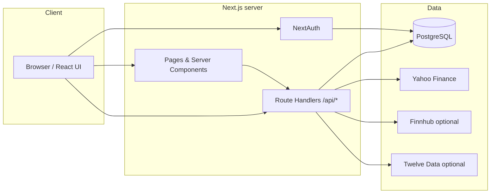
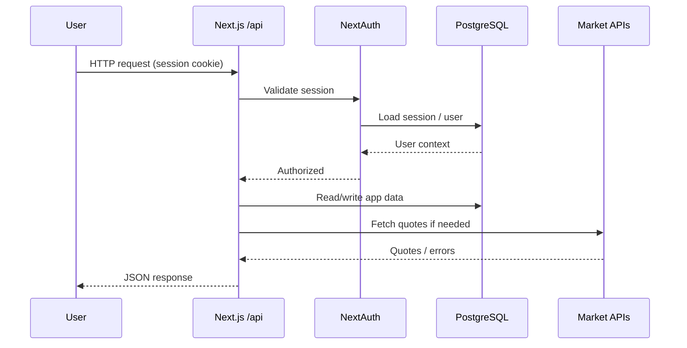

# Stock Tracker

**Stock Tracker** is a full-stack web app for watching markets, managing portfolios, and tracking alerts. Users sign in with Google, persist data in PostgreSQL, and pull live and historical quotes (Yahoo Finance primary, with Finnhub / Twelve Data fallbacks).

**Live demo:** [https://stock-tracker-haphan.vercel.app/](https://stock-tracker-haphan.vercel.app/)

---

## Architecture Overview

High-level system: the browser talks to **Next.js** (App Router). Server routes use **Prisma** for PostgreSQL and call market data providers. **NextAuth** handles Google OAuth and session storage in the database.



Request flow for a typical authenticated API call (e.g. watchlist):



---

## Tech Stack and Major Dependencies

| Area                   | Technology                                                                                                       |
| ---------------------- | ---------------------------------------------------------------------------------------------------------------- |
| Framework              | [Next.js 15](https://nextjs.org/) (App Router), React 19, TypeScript                                             |
| Auth                   | [NextAuth.js v4](https://next-auth.js.org/), `@next-auth/prisma-adapter`                                         |
| Database               | [PostgreSQL](https://www.postgresql.org/) via [Prisma ORM](https://www.prisma.io/)                               |
| Caching / server state | [TanStack Query](https://tanstack.com/query)                                                                     |
| UI                     | [Tailwind CSS 4](https://tailwindcss.com/), [Radix UI](https://www.radix-ui.com/), [Lucide](https://lucide.dev/) |
| Charts                 | [Recharts](https://recharts.org/)                                                                                |
| Stock data             | [yahoo-finance2](https://github.com/gadicc/yahoo-finance2), Finnhub / Twelve Data                       |
| Validation / env       | [Zod](https://zod.dev/)                                                                                          |
| Logging                | [Pino](https://getpino.io/)                                                                                      |
| Errors                 | [@sentry/nextjs](https://docs.sentry.io/platforms/javascript/guides/nextjs/)                                     |
| Quality                | ESLint, Prettier, Vitest, Husky                                                                                  |


---

## Installation and Setup (Local)

These steps were checked on a clean `npm install` and `npm run typecheck` in this repository. You need **PostgreSQL** running locally (or a cloud URL in `DATABASE_URL`) before migrations will succeed.

### Prerequisites

1. **Node.js** 20.11+ (LTS recommended).
2. **PostgreSQL** 14+ with a database created (e.g. `stock_tracker`).
3. A **Google Cloud** project with OAuth 2.0 **Web application** credentials (for sign-in).

### Steps

```bash
git clone <repository-url>
cd Stock-Tracker
npm install
cp env.example .env
```

Edit `.env`:

- Set `DATABASE_URL` to your Postgres connection string.
- Set `DIRECT_URL` to the same value for local dev (or your direct connection if you split pooler/direct in production).
- Set `NEXTAUTH_URL=http://localhost:3000`.
- Set `NEXTAUTH_SECRET` to a random string **at least 32 characters** (e.g. `openssl rand -base64 32`).
- Set `GOOGLE_CLIENT_ID` and `GOOGLE_CLIENT_SECRET` from Google Cloud Console.

**Google OAuth (local):** add authorized JavaScript origin `http://localhost:3000` and redirect URI `http://localhost:3000/api/auth/callback/google`.

Apply database schema:

```bash
npm run db:generate
npm run db:migrate
```

Start the dev server:

```bash
npm run dev
```

Open [http://localhost:3000](http://localhost:3000).

**Optional checks:**

```bash
npm run typecheck
npm run lint
npm test
```

---

## Usage Examples

### Run the App

```bash
npm run dev
```

Default dev server: **http://localhost:3000**

### Production Run

```bash
npm run build
npm start
```

### Example: use the UI

1. Click **Sign In** and complete Google OAuth.
2. On the **Dashboard**, use the search box: type **`AAPL`** or **`Apple`** and open a symbol.
3. Add symbols to the **Watchlist**; open **Portfolio** to create holdings or transactions.
4. **Analytics** summarizes allocation; **Alerts** can watch price thresholds.

### Example: API without browser (session required for most routes)

Health check (no auth):

```bash
curl -s http://localhost:3000/api/health
```

Authenticated endpoints expect a session cookie from the browser after login; use the UI or tooling that preserves cookies for manual API testing.

---

## Repository folder structure

```
Stock-Tracker/
├── app/                    # Next.js App Router: pages, layouts, global styles
│   ├── api/                # REST-style route handlers (portfolio, stocks, auth, …)
│   ├── auth/               # Sign-in UI
│   ├── portfolio/          # Portfolio pages
│   ├── stocks/             # Symbol detail routes
│   ├── watchlist/, alerts/, analytics/, settings/
│   └── …
├── src/
│   ├── components/         # React components (incl. ui/, providers/)
│   ├── hooks/              # Custom hooks
│   ├── lib/                # Prisma client, auth, env, providers (Yahoo, Finnhub, …)
│   └── types/              # Shared TypeScript types
├── prisma/
│   ├── schema.prisma       # Data model
│   └── migrations/         # SQL migrations
├── public/                 # Static assets
├── docker/                 # Docker-related files (if used)
├── docker-compose.yml      # Optional local stack
├── env.example             # Environment template
├── vercel.json             # Vercel build command override
├── next.config.ts
├── instrumentation.ts    # Sentry / runtime hooks
└── package.json
```

---

## Deployment (Vercel + Supabase Postgres)

- **Build:** `vercel-build` runs `prisma generate`, `prisma migrate deploy`, then `next build` (see `vercel.json` and `package.json`).
- **Env:** Set `DATABASE_URL`, `DIRECT_URL` (can match pooler URL if you only use Supabase session pooler), `NEXTAUTH_URL` (your public origin), `NEXTAUTH_SECRET`, Google OAuth IDs.
- **OAuth:** Authorized origins and redirect URIs must match the deployed host exactly.

---

## Security notes

- Do not commit `.env`.
- Rotate any secret that was exposed (database password, `NEXTAUTH_SECRET`, OAuth client secret).
- Keep Google OAuth redirect URIs strict and aligned with each environment (local, preview, production).
